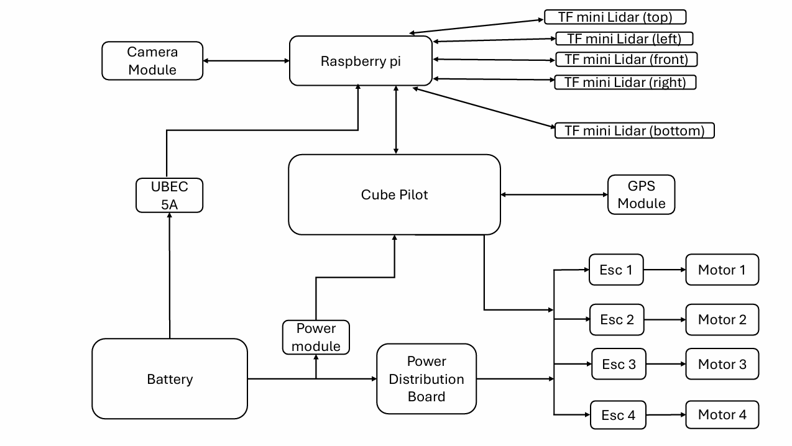
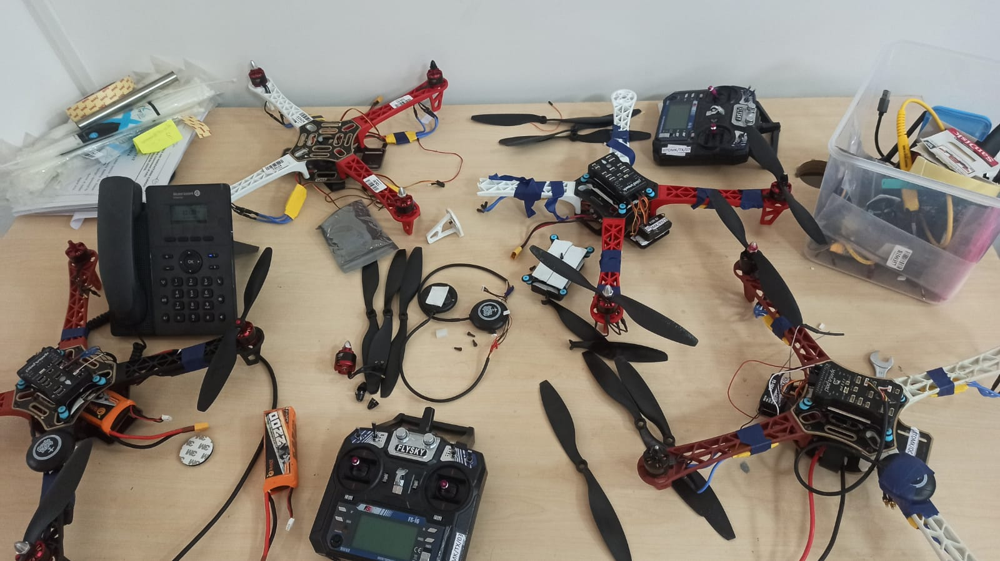
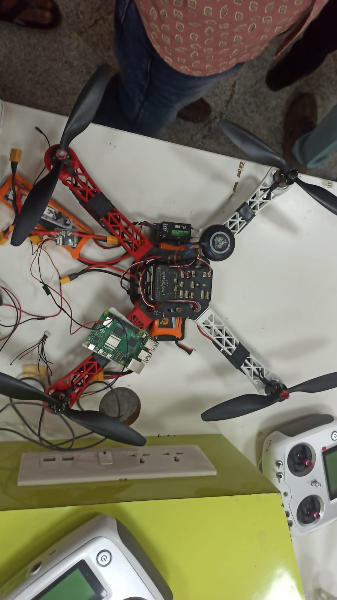
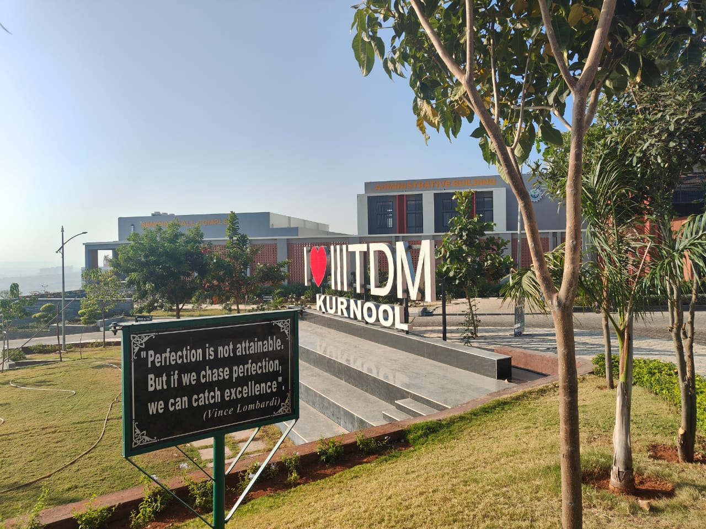

# 🛸 Autonomous Drone Obstacle Avoidance System

GPS-enabled IoT Drone Project 
---
## 🔍 At a Glance

### 🧩 Problem it Solves
Develops an **autonomous drone system with GPS-based navigation** that can intelligently **detect and avoid obstacles** mid-flight using depth estimation and LiDAR. It’s designed to operate in outdoor or semi-structured environments where GPS is available but **obstacle detection is critical** for safe mission execution.

### ✨ Key Features
- 🚁 **Autonomous flight navigation using GPS coordinates**
- 🧱 **Real-time obstacle detection** with TFMini-S LiDAR
- 📷 **Depth estimation** using camera module + OpenCV
- 🧠 **Decision logic** to halt or redirect flight path upon obstacle encounter
- 🔌 **MAVLINK integration** for streamlined control over PX4 flight stack
- 🧪 **Field-tested with GPS data and simulated obstacle zones**

### 🛠️ Tech Stack
- **Hardware**: Raspberry Pi 5, TFMini-S LiDAR, GPS Module, Camera Module  
- **Software**: MAVLINK Protocols, OpenCV, Python  
- **Tools**:Mission Planner, QGroundControl, Git, Ubuntu 20.04  
---
## 🧠 Summary

This project showcases a GPS-guided **autonomous drone** built using **Raspberry Pi**, **LiDAR sensors**, and **Python**, capable of detecting and avoiding obstacles in real-time.

Developed during my undergraduate journey, this project served as an impactful demonstration of **IoT + Embedded Systems + Edge AI**, earning recognition in the **ISRO Challenge 2025**. It simulates real-world applications like disaster recovery, defense surveillance, and smart delivery systems.

---

## 🔧 Technologies & Tools Used

| Category       | Details                                                   |
|----------------|-----------------------------------------------------------|
| **Hardware**   | Raspberry Pi 4, TFmini-S LiDAR Sensor (5), GPS Module, Drone Frame |
| **Software**   | Python 3.x, RPi.GPIO, OpenCV, NumPy                        |
| **Concepts**   | Real-Time Edge Processing, Obstacle Avoidance, IoT        |
| **Tools**      | VS Code, Git, CLI                                          |

---
## 🧭 System Architecture



> This diagram illustrates how components like the Raspberry Pi, LiDAR, GPS, and motor controller communicate within the system.

## 🚀 Key Features

- 🛰️ **GPS-Based Path Navigation**: Drone follows destination coordinates autonomously.
- 🔍 **Real-Time Obstacle Avoidance**: Uses LiDAR to detect and avoid objects during flight.
- ⚙️ **Modular Python Codebase**: Easy to integrate with new sensors or change flight logic.
- 🧠 **Edge Computing**: Raspberry Pi handles all sensor inputs and decisions on-board.
- 🏆 **ISRO Challenge 2025**: Qualified for the challenge demonstrating autonomous flight capabilities.

---

## 🗂️ Project Structure

```
Autonomous-Drone-Obstacle-Avoidance/
├── Tests/                     # Video demonstration and test scenarios
├── config/                   # Parameter configuration files
├── docs/                     # Project documentation
├── sensors/                  # LiDAR and sensor integration scripts
├── README.md                 # Project overview (this file)
├── main.py                   # Main script for drone control and logic
├── requirements.txt          # Python dependencies
└── system_architecture.png   # System architecture diagram
```

---

## 📸 Project Demo – Drone Setup

| Setup View 1 | Setup View 2 |
|--------------|--------------|
|  |  |

> These images show the drone's internal wiring, Raspberry Pi placement, and sensor modules including GPS and LiDAR.

---

## 🛠️ Getting Started (for Demonstration)

> ⚠️ Note: A physical drone, GPS, and LiDAR module are needed to fully test this system.

### 1. Clone the repository

```bash
git clone https://github.com/ManojCodeCraft/Autonomous-Drone-Obstacle-Avoidance.git
cd Autonomous-Drone-Obstacle-Avoidance
```

### 2. Install Dependencies

```bash
pip install -r requirements.txt
```

### 3. Run the System

```bash
python main.py
```

---

## 🎯 Impact & Applications

| Domain             | Application Example                                       |
|--------------------|-----------------------------------------------------------|
| Disaster Response  | Autonomous drones scanning collapsed structures           |
| Defense & Security | Surveillance in GPS-denied environments                   |
| Smart Delivery     | Navigating indoor/outdoor routes while avoiding obstacles |
| Research & R&D     | Rapid prototyping for drone AI navigation systems         |

---

## 🎓 Built At – IIITDM Kurnool



> This project was developed during my undergraduate journey at **IIITDM Kurnool** as part of an IoT lab initiative.


## 🧑‍💻 About Me

**Manoj Kumar**  
Aspiring Software Developer & IoT Enthusiast
- 🔗 LinkedIn: [linkedin.com/in/manoj-kumar-a-21ab69258](https://www.linkedin.com/in/manoj-kumar-a-21ab69258/)  
- 💻 GitHub: [github.com/ManojCodeCraft](https://github.com/ManojCodeCraft)

---

## 📃 License

This project is licensed under the MIT License. See `LICENSE` for details.
